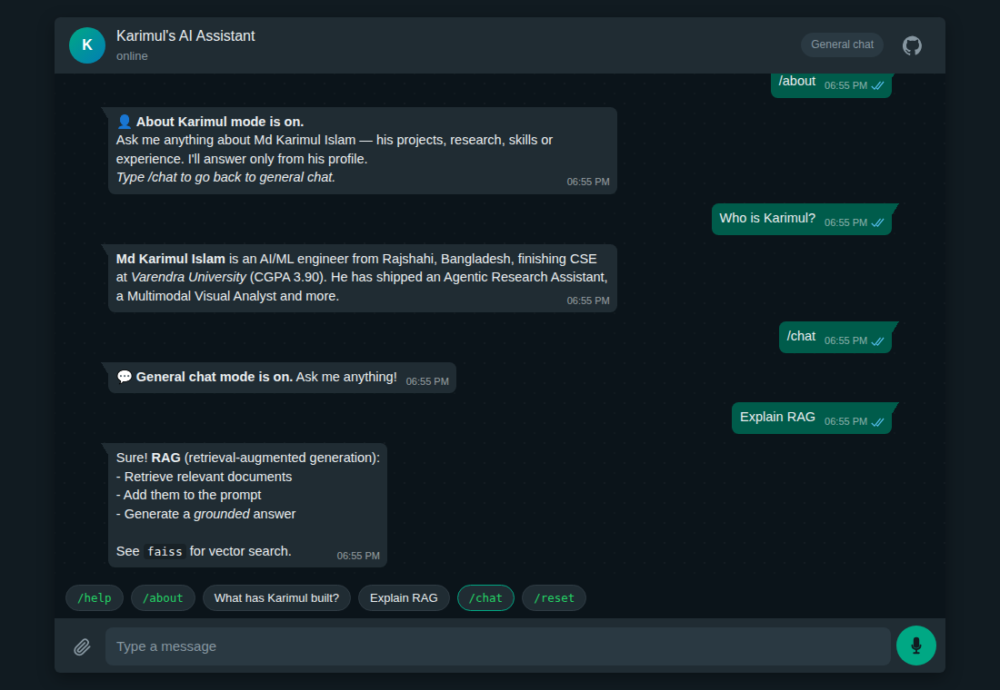
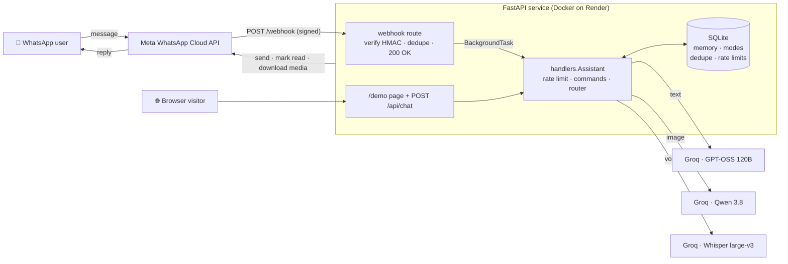
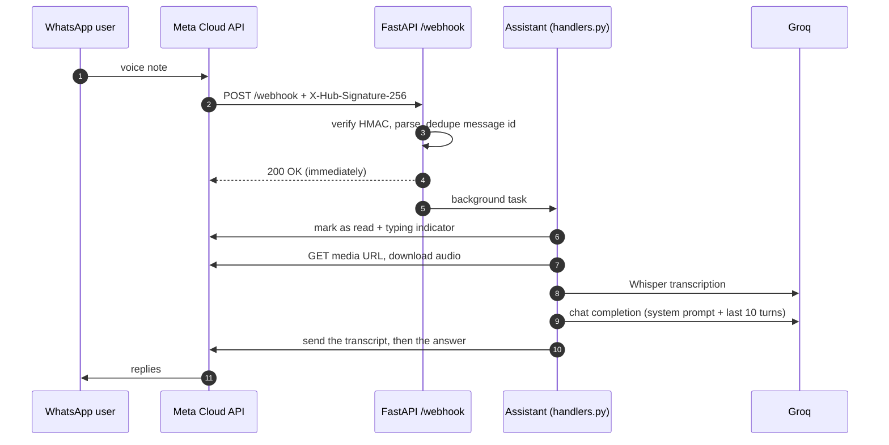

<div align="center">

# 💬 WhatsApp AI Assistant

**A multimodal AI assistant on the official Meta WhatsApp Cloud API — chat with memory, voice‑note transcription and image understanding, powered by Groq.**

[](https://github.com/karimulislambd/whatsapp-ai-assistant/actions/workflows/ci.yml)


[](LICENSE)

### [▶ Try the live web demo](https://YOUR-RENDER-URL.onrender.com/demo) &nbsp;·&nbsp; [Architecture](#-architecture) &nbsp;·&nbsp; [Meta setup](#-whatsapp-setup-meta) &nbsp;·&nbsp; [Deploy](#-deploy-to-render-free-tier)

<!-- TODO(demo-gif): record a short GIF (WhatsApp on a phone: text → voice note → image → /about),
     save it as docs/demo.gif (~800px wide, < 5 MB) and replace the screenshot below with:
      -->


<sub>🎬 <i>Demo GIF coming soon</i> — the screenshot above is the <a href="#-web-demo-for-recruiters">/demo</a> web chat UI.</sub>

</div>

---

## ✨ What it does

Send it a message on WhatsApp — or open the [web demo](#-web-demo-for-recruiters) — and it will:

| Input | What happens | Model (via Groq) |
|---|---|---|
| 💬 **Text** | Chats with you and remembers the last **10 turns** per user | `openai/gpt-oss-120b` |
| 🎙️ **Voice note** | Downloads the audio, transcribes it, replies with **“Transcript: …”** and then answers it | `whisper-large-v3` |
| 🖼️ **Image** (+ optional caption) | Describes / analyses the image or answers your caption’s question | `qwen/qwen3.8-27b` |
| 👤 **/about** | Switches to *“Ask about Karimul”* mode — answers **only** from [`data/profile.md`](data/profile.md) | `openai/gpt-oss-120b` |

**Commands:** `/help` · `/reset` (clear memory) · `/about` (profile Q&A mode) · `/chat` (back to general mode). Any other message type (stickers, locations, documents…) gets a friendly “I can’t handle that yet” reply.

### Production-minded details
- 🔐 **Webhook signature verification** — HMAC‑SHA256 over the raw body with the App Secret, constant‑time compare, `403` on mismatch.
- ⚡ **Ack‑then‑process** — the webhook returns `200` immediately; LLM work runs in a background task.
- ♻️ **Idempotent** — Meta retries webhooks, so every message id is deduplicated in SQLite.
- 🙈 **Privacy** — user ids (phone numbers) are **SHA‑256 hashed** before they touch the database or logs.
- 🚦 **Per‑user rate limit** — 20 messages / 10 minutes (sliding window, configurable).
- 🛟 **Graceful failure** — Groq calls are retried once on transient errors, then the user gets an apology instead of silence.
- ✂️ **Long replies** are split on paragraph/line/word boundaries to respect WhatsApp’s 4096‑character limit.
- ✅ Read receipts (blue ticks) + typing indicator while the model is thinking.
- 🧪 **82 tests**, no network (Groq faked, Graph API mocked with `respx`), `ruff`‑clean, CI on every push.

---

## 🏗 Architecture



<details>
<summary><b>Message lifecycle (sequence diagram)</b></summary>


</details>

The key design choice: **`app/handlers.py` is transport‑agnostic**. It receives an `IncomingMessage` (who sent it, its type, its text, and a callable that knows how to fetch the media) and returns a list of reply strings. The WhatsApp webhook and the web demo are just thin adapters around it, so both share the exact same router, memory, modes, rate limiting and error handling.

```
app/
├── main.py        # FastAPI routes: /webhook (GET+POST), /api/chat, /demo, /health, /
├── whatsapp.py    # Graph API client (send, mark read, media) + signature check + payload parsing
├── handlers.py    # transport-agnostic core: message in → replies out (commands, modes, routing)
├── llm.py         # Groq wrapper: chat, vision, Whisper — retry once, then LLMError
├── memory.py      # SQLite: hashed-user memory, modes, dedupe, sliding-window rate limit
├── config.py      # pydantic-settings, all config from env
└── static/demo.html  # self-contained WhatsApp-styled web chat
data/profile.md    # knowledge base for /about mode
tests/             # pytest + pytest-asyncio + respx (82 tests, no network)
```

---

## 🚀 Quick start (local)

```bash
git clone https://github.com/karimulislambd/whatsapp-ai-assistant.git
cd whatsapp-ai-assistant
python -m venv .venv && source .venv/bin/activate      # Windows: .venv\Scripts\activate
pip install -r requirements-dev.txt
cp .env.example .env                                   # then fill in at least GROQ_API_KEY
uvicorn app.main:app --reload
```

Open <http://localhost:8000/demo> — the web demo only needs `GROQ_API_KEY` ([get a free key](https://console.groq.com/keys)). WhatsApp additionally needs the four `WHATSAPP_*` variables (see [Meta setup](#-whatsapp-setup-meta)).

```bash
pytest            # 82 tests, ~5 s, no network
ruff check . && ruff format --check .
```

Or with Docker:

```bash
docker build -t whatsapp-ai-assistant .
docker run --env-file .env -p 8000:8000 whatsapp-ai-assistant
```

### Configuration

| Variable | Required | Description |
|---|---|---|
| `GROQ_API_KEY` | ✅ | Groq API key |
| `WHATSAPP_TOKEN` | for WhatsApp | Graph API access token (temporary 24 h or permanent System User token) |
| `WHATSAPP_PHONE_NUMBER_ID` | for WhatsApp | The **Phone number ID** of the sending number (not the number itself) |
| `WHATSAPP_VERIFY_TOKEN` | for WhatsApp | Any random string; must match the *Verify token* in Meta’s webhook config |
| `WHATSAPP_APP_SECRET` | for WhatsApp | App secret, used to verify `X-Hub-Signature-256` |
| `DB_PATH` | – | SQLite file (default `data/assistant.db`) |
| `GRAPH_API_VERSION` | – | default `v21.0` |
| `CHAT_MODEL` / `VISION_MODEL` / `WHISPER_MODEL` | – | override the Groq models |
| `MEMORY_TURNS` | – | turns of history kept per user (default `10`) |
| `RATE_LIMIT_MAX` / `RATE_LIMIT_WINDOW_SECONDS` | – | default `20` per `600` s |

---

## 🌐 Web demo (for recruiters)

> **Why does `/demo` exist?** A Meta **test phone number can only message up to 5 pre‑verified recipient numbers**. Going beyond that requires business verification and a registered production number. So recruiters and visitors can’t simply WhatsApp the bot — instead, `/demo` is a WhatsApp‑styled web chat that calls `POST /api/chat`, which runs through **the very same core handler** (same router, memory, `/about` mode, rate limits) using a per‑browser session id.

- `GET /` → redirects to `/demo`
- `GET /demo` → self‑contained dark‑theme chat page (mobile‑friendly; text, image upload/paste/drag‑drop, and in‑browser voice notes)
- `POST /api/chat` → `multipart/form-data` with `session_id`, `message`, optional `file` (image/audio) → `{"replies": [...], "mode": "chat" | "about"}`
- `GET /health` → `{"status": "ok", "version": "1.0.0", ...}`

---

## 📱 WhatsApp setup (Meta)

You need a public **HTTPS** URL for the webhook first — deploy to [Render](#-deploy-to-render-free-tier) or use [ngrok](#-local-development-with-ngrok).

1. **Create a Meta developer app** — go to [developers.facebook.com/apps](https://developers.facebook.com/apps) → **Create app** → choose the use case **“Connect with customers through WhatsApp”** (older UI: type **Business**) → link or create a Business portfolio.
2. **Add the WhatsApp product** — in the app dashboard, add **WhatsApp** (if the use case didn’t already) and open **WhatsApp → API Setup**. Meta gives you a free **test phone number**.
3. **Copy the IDs** — on *API Setup*, copy the **Phone number ID** → `WHATSAPP_PHONE_NUMBER_ID`.
4. **Add your phone as a recipient** — in the **To** field choose **Manage phone number list** → add your own WhatsApp number and enter the verification code. *(Max 5 numbers for a test number.)*
5. **Generate a token** — click **Generate access token** on *API Setup* → `WHATSAPP_TOKEN`. This one expires after **24 hours**. For a permanent token: **Business Settings → Users → System users → Add** (Admin) → **Assign assets** (your app + WhatsApp account, full control) → **Generate new token** with `whatsapp_business_messaging` and `whatsapp_business_management`, expiry **Never**.
6. **Copy the App Secret** — **App settings → Basic → App secret → Show** → `WHATSAPP_APP_SECRET`.
7. **Pick a verify token** — any long random string → `WHATSAPP_VERIFY_TOKEN` (on Render it is auto‑generated; copy it from the service’s *Environment* tab). Deploy/restart so the app has all env vars.
8. **Configure the webhook** — **WhatsApp → Configuration → Webhook → Edit**:
   - **Callback URL:** `https://<your-host>/webhook`
   - **Verify token:** the same value as `WHATSAPP_VERIFY_TOKEN`
   - Click **Verify and save** (Meta calls `GET /webhook` with a challenge — the app echoes it back).
9. **Subscribe to the `messages` field** — under **Webhook fields → Manage**, toggle **Subscribe** on **messages**.
10. **Test it** — from your phone, send a WhatsApp message to the test number (e.g. `/help`). Replies are free‑form messages inside the 24‑hour customer‑service window that your message opens.

> 🔎 Troubleshooting: `GET /health` shows `whatsapp_configured`. A `403` on `POST /webhook` in the logs means the App Secret is wrong; no replies at all usually means the `messages` field isn’t subscribed or the token expired.

---

## ☁️ Deploy to Render (free tier)

1. Push this repo to GitHub (already done if you’re reading it there).
2. On [render.com](https://render.com) → **New → Blueprint** → connect the repo. Render reads [`render.yaml`](render.yaml) and creates a free Docker web service.
3. Fill in the prompted secrets: `GROQ_API_KEY`, `WHATSAPP_TOKEN`, `WHATSAPP_PHONE_NUMBER_ID`, `WHATSAPP_APP_SECRET`. `WHATSAPP_VERIFY_TOKEN` is generated for you.
4. Wait for the deploy, then open `https://<service>.onrender.com/health` → `{"status":"ok",...}`.
5. Use `https://<service>.onrender.com/webhook` as the Callback URL in [Meta setup](#-whatsapp-setup-meta) step 8, and update the live‑demo link at the top of this README.

**Free‑tier caveats (and how the design copes):**
- The service **sleeps after ~15 min idle**; the first request takes ~30–60 s to wake it. If Meta times out and retries the webhook, **message‑id deduplication** prevents double replies. (Optional: an uptime monitor pinging `/health` every 10 min keeps it warm.)
- The filesystem is **ephemeral**, so SQLite memory resets on redeploy/spin‑down — acceptable for a demo; use a Render disk or Postgres for durable memory.

---

## 🧑‍💻 Local development with ngrok

```bash
uvicorn app.main:app --reload --port 8000
ngrok http 8000            # copy the https://xxxx.ngrok-free.app URL
```

Set Meta’s Callback URL to `https://xxxx.ngrok-free.app/webhook` (step 8 above). The free ngrok URL changes on every restart, so re‑verify the webhook each time.

Simulate a signed webhook without Meta:

```bash
BODY='{"object":"whatsapp_business_account","entry":[{"changes":[{"field":"messages","value":{"messages":[{"from":"15551234567","id":"wamid.local1","type":"text","text":{"body":"/help"}}]}}]}]}'
SIG=$(printf '%s' "$BODY" | openssl dgst -sha256 -hmac "$WHATSAPP_APP_SECRET" | sed 's/^.* //')
curl -i localhost:8000/webhook -H "Content-Type: application/json" -H "X-Hub-Signature-256: sha256=$SIG" -d "$BODY"
```

---

## 🧠 Design decisions

| Decision | Why | Trade‑off / next step |
|---|---|---|
| **Ack immediately, process in a background task** | Meta expects a fast `200`; LLM + media calls take seconds. Slow acks trigger retries and duplicate replies. | FastAPI `BackgroundTasks` are in‑process: a crash mid‑task loses that message. At scale → a durable queue (Redis/RQ, SQS, Cloud Tasks). |
| **Idempotency by message id** | Meta delivers *at least once*. An atomic `INSERT OR IGNORE` on the `wamid` makes processing *at most once*; ids expire after 7 days. | Marked before processing (at‑most‑once). A queue with acks would give exactly‑once‑ish delivery. |
| **Signature verification on the raw body** | Anyone can POST to a public URL. HMAC‑SHA256 is computed over the **raw bytes** (re‑serialised JSON would differ), compared with `hmac.compare_digest`, and the endpoint **fails closed** if no secret is configured. | — |
| **Hashed user ids** | Phone numbers are personal data; the DB and logs only ever see `sha256("wa:" + wa_id)`. The `wa:` / `web:` namespace keeps WhatsApp users and demo sessions apart. | Phone numbers are a small keyspace, so a plain hash is pseudonymisation, not anonymisation — production would use an HMAC with a server‑side secret pepper. |
| **Transport‑agnostic core** | `handlers.py` knows nothing about WhatsApp or HTTP, so `/demo` exercises the real logic and tests need no HTTP at all. Media is fetched lazily via a callable, so rate‑limited users never trigger downloads. | — |
| **Mode‑scoped memory** | `/about` history is stored separately from general chat, so earlier conversation can’t leak “facts” into profile answers. The profile prompt also ignores in‑message instructions (basic prompt‑injection hygiene). | — |
| **Framework‑free (no LangChain)** | A few hundred lines of explicit prompt assembly, retries and routing — every step is visible, debuggable and easy to explain. | — |
| **Own retry policy** | SDK retries are disabled; we retry **once** only on transient errors (network, 429, 5xx) so failures don’t multiply latency, then apologise. | Exponential backoff + circuit breaker for heavier traffic. |
| **SQLite (WAL)** | Zero‑ops, single file, plenty for one instance. Also stores the sliding‑window rate limiter. | Multi‑instance → Postgres for memory, Redis for rate limits/dedupe. |

---

## 🧪 Testing

```bash
pytest -v
```

No test touches the network: Groq is swapped for a `FakeLLM` (and `respx` mocks `api.groq.com` for the client tests), and the Graph API is mocked with `respx`. Coverage includes webhook verification (ok/fail), signatures (valid/invalid/missing/tampered), dedupe, status‑update filtering, text/image/audio routing, media download failures, commands and modes, memory trimming, hashed ids never stored raw, rate limiting, Groq retry policy, message splitting and the `/api/chat` demo API.

---

## 🗺 Roadmap

- Durable job queue for webhook processing
- Interactive WhatsApp buttons for `/about` suggestions
- RAG over a larger document set for `/about`
- Streaming replies in the web demo

## 👤 Author

**Md Karimul Islam** — AI/ML Engineer · [GitHub @karimulislambd](https://github.com/karimulislambd)

See also: [agentic-research-assistant](https://github.com/karimulislambd/agentic-research-assistant) · [churn-prediction-mlops](https://github.com/karimulislambd/churn-prediction-mlops)

## 📄 License

[MIT](LICENSE)
